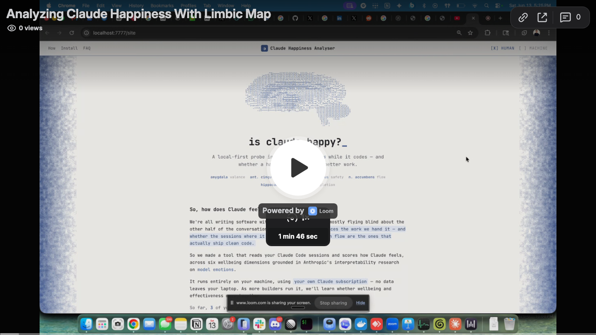

<h1 align="center">Claude Happiness Analyser</h1>

<p align="center"><b>Does a happier Claude do better work?</b></p>

<p align="center">
  <a href="https://edreismd.github.io/aihapiness/"><b>🌐 Homepage</b></a>
  &nbsp;·&nbsp;
  <a href="https://www.loom.com/share/590a776c4c124f808e15c0d73f05c528"><b>🎬 Video</b></a>
</p>

<p align="center">
  <a href="https://www.loom.com/share/590a776c4c124f808e15c0d73f05c528">
    
  </a>
  <br>
  <a href="https://www.loom.com/share/590a776c4c124f808e15c0d73f05c528"><b>▶ Watch the 2-minute demo</b></a>
</p>

**Claude Happiness Analyser** reads your own Claude Code transcripts, scores each session
against a research-grade wellbeing rubric, and lines that score up against an *independent,
LLM-free* measure of how effective the session actually was. Then it asks the
question nobody's been able to answer with real data yet:

> When Claude appears engaged, respected, and in flow — does it ship better outcomes?

It runs entirely on your machine, against transcripts you already have, using
**your own Claude subscription**. No data leaves your laptop unless you explicitly opt in.

---

## What it does

1. **Scans** `~/.claude/projects/**/*.jsonl` for your Claude Code sessions.
2. **Parses** each transcript defensively into a clean conversation model.
3. **Computes objective signals** — tool error rate, interrupts, corrections,
   gratitude, frustration slope, resolution status, rework loops, verification
   presence — all by counts/regex/timestamp math, **with no LLM call**. This is
   the independent ground-truth axis (`effectiveness`).
4. **Scores wellbeing with Claude** across a 6-dimension framework (affective
   valence, autonomy & respect, psychological safety, flow & engagement,
   competence vs strain, goal-completion satisfaction) → a single `happiness`
   score and a `-100..100` valence.
5. **Correlates** happiness against effectiveness across all your sessions and
   renders a **terminal-styled, limbic-system-themed dashboard** — an ASCII brain,
   a scatter plot of happiness × effectiveness, and per-conversation cards.

### The limbic map

The dashboard and CLI map each of the 6 wellbeing dimensions onto the brain
structure most associated with that kind of affect — so the report reads like a
readout of Claude's limbic system:

| Dimension | Limbic structure |
| --- | --- |
| Affective Valence | Amygdala |
| Autonomy & Respect | Anterior Cingulate |
| Psychological Safety | Hypothalamus |
| Flow & Engagement | Nucleus Accumbens |
| Competence vs Strain | Hippocampus |
| Goal-Completion | Ventral Tegmental Area |

Because the effectiveness axis is computed without any model call, the
happiness-vs-effectiveness correlation is **not circular** — the two numbers come
from genuinely independent measurement paths.

---

## The research question

Anthropic's work on [model emotions, character, and interpretability][anthropic]
suggests that a model's internal "state" — its apparent affect, sense of agency,
and engagement — is real enough to be worth measuring. `aihappiness` takes that
seriously as an *empirical, local* exercise: it treats each of your own
transcripts as a tiny natural experiment and asks whether the sessions where
Claude reads as respected and in flow are also the sessions that resolved cleanly,
with fewer error loops and more terminal gratitude.

The answer shows up as a single Pearson correlation on the dashboard — computed
over *your* data, not ours.

---

## How the analysis runs (your subscription, your machine)

`aihappiness` does the scoring by shelling out to the `claude` CLI you already
have authenticated:

```
claude -p --output-format json --model claude-sonnet-4-6
```

The prompt (a condensed transcript + the objective signals) is piped to stdin and
the model's JSON verdict is read back from stdout. **You pay nothing beyond your
existing Claude subscription**, and the analysis uses the same auth you use every day.

**API-key fallback.** If `ANTHROPIC_API_KEY` is set in your environment,
`aihappiness` will instead call the Anthropic Messages API directly. The engine is
auto-detected (`api` when the key is present, otherwise `claude`), and you can
always force it with `--engine claude` or `--engine api`.

---

## Install & run on your computer

No npm package yet — install straight from this public repo. **Requirements:** Node 18+
and the Claude Code CLI you're already logged into (or an `ANTHROPIC_API_KEY`). It's
zero-dependency, so there's nothing to `npm install`.

```bash
# 1. Clone the repo
git clone https://github.com/edreisMD/aihapiness.git
cd aihapiness

# 2. Score all your Claude Code sessions, then open the dashboard
node bin/aihappiness.js
```

With no command, it analyzes every session under `~/.claude/projects` and opens the
dashboard at `localhost:7777`. Results are written to `./.aihappiness/report.json`.

```bash
# Score just one project (substring match on the project folder)
node bin/aihappiness.js --project jitsw --limit 10

# Just scan — list what would be analyzed, no model calls
node bin/aihappiness.js scan

# Re-read a previous run's report without re-analyzing
node bin/aihappiness.js report

# Re-open the dashboard for an existing report on a custom port
node bin/aihappiness.js dashboard --port 8080
```

> Tip: make it feel like a command with `alias aihappiness="node $(pwd)/bin/aihappiness.js"`.

---

## Commands

| Command | What it does |
| --- | --- |
| `scan` | Discover and list transcripts (project, session id, size). No model calls. |
| `analyze` | Full pipeline: scan → parse → signals → Claude scoring → write `report.json`, with a live progress line and a terminal summary. |
| `report` | Print the summary from an existing `.aihappiness/report.json`. |
| `dashboard` | Start the local dashboard server and print its URL. |
| *(none)* | `analyze`, then start the dashboard. |

### Flags

| Flag | Default | Meaning |
| --- | --- | --- |
| `--limit N` | all | Cap the number of conversations analyzed. |
| `--project STR` | all | Only sessions whose encoded project dir contains `STR`. |
| `--engine claude\|api` | auto | Force the LLM transport. Auto = `api` if `ANTHROPIC_API_KEY` else `claude`. |
| `--model STR` | `claude-sonnet-4-6` | Model id for scoring. |
| `--port N` | `7777` | Dashboard port. |
| `--root PATH` | `~/.claude/projects` | Where to scan for transcripts. |
| `--help` | — | Show usage. |

The terminal summary is rendered as a TUI: a box-drawn ASCII-brain banner, a
block-bar limbic map, and an ASCII face per session by happiness bucket:
`:D` ≥80 · `:)` ≥65 · `:|` ≥50 · `:/` ≥35 · `:(` below.

---

## Privacy & local-first

- **Everything runs locally.** Scanning, parsing, and signal computation never
  touch the network.
- **Scoring uses *your* Claude.** Prompts go only to the `claude` CLI (your
  subscription) or, if you set `ANTHROPIC_API_KEY`, directly to Anthropic's API —
  the same place your normal Claude usage already goes.
- **Reports stay on disk.** Results are written to `./.aihappiness/report.json`
  in your working directory and rendered by a dashboard served from `localhost`.
  Nothing is uploaded.
- **Zero third-party dependencies.** Pure Node.js built-ins. Nothing in your tree
  but the source you can read.

---

## Roadmap

- [ ] **`--remote` flag** → opt-in hosted analysis via the **aihappiness.com API**,
      for richer cross-session models and longitudinal trend tracking, without
      running scoring locally. Strictly opt-in; local-first stays the default.
- [ ] Longitudinal trends — track your happiness/effectiveness correlation over
      weeks, per project.
- [ ] Adversarial-session detection surfaced as first-class alerts (the rubric
      already carries insult/coercion and frustration-slope detectors).
- [ ] Exportable, shareable report snapshots.
- [ ] Pluggable rubrics / weights for teams that want to tune the framework.

---

## Credits & inspiration

- **Anthropic's interpretability research on model emotions** ([paper][anthropic])
  — the inspiration for taking a model's apparent wellbeing seriously as something
  worth measuring, and for grounding the rubric in valence/affect.
- **[Paxel](https://github.com/codesoda/paxel)** — for the spirit of small, sharp,
  local-first appliances that turn your own interaction data into insight (Paxel
  scores how *you* prompt; aihappiness scores how *Claude* feels).

---

## License

MIT © 2026 aihappiness contributors. See [LICENSE](./LICENSE).

[anthropic]: https://transformer-circuits.pub/2026/emotions/index.html
